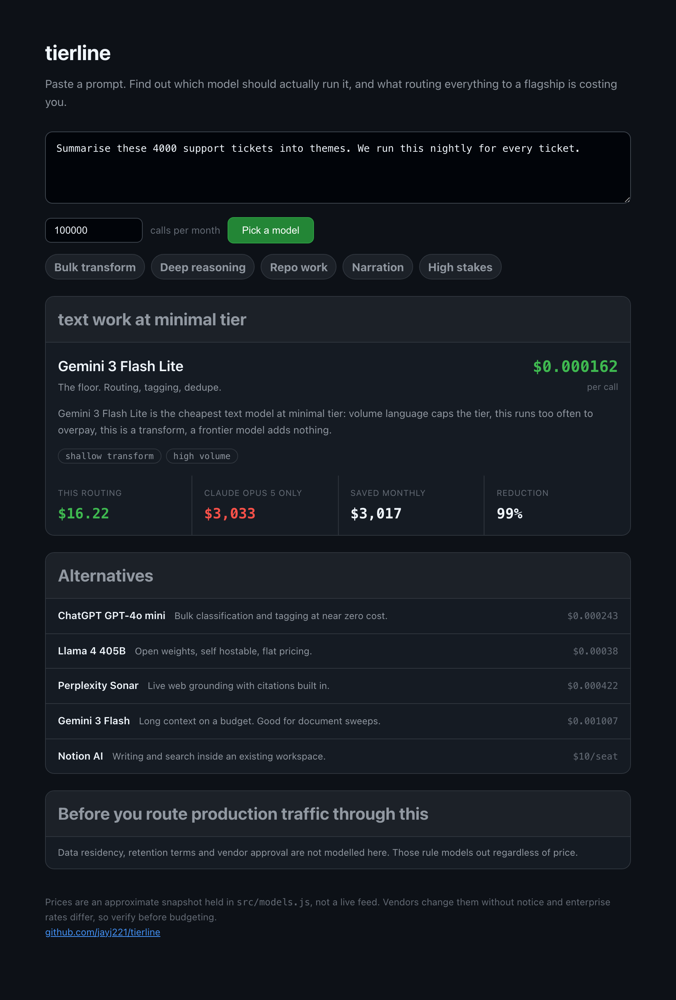

<div align="center">

# tierline

**Paste a prompt. Find out which model should actually run it.**

[](https://nodejs.org)
[](package.json)
[](https://github.com/jayj221/tierline/actions/workflows/test.yml)
[](LICENSE)

</div>

```console
$ npx tierline "summarise these 4000 support tickets into themes, we run this nightly" -n 100000

  Gemini  Gemini 3 Flash Lite   text / minimal tier
  The floor. Routing, tagging, dedupe.

  $0.000162 per call
  at 100,000 calls a month  $16.22
  everything through Claude Opus 5  $3,033
  saves $3,017 a month, 99%
```

<div align="center">
  
</div>

Most teams pick one frontier model and send everything to it. That is the single most expensive habit in an AI budget, because the majority of production prompts are transforms that a model costing a hundredth as much would handle identically.

tierline reads the prompt, works out what the job actually needs, and names the cheapest model that clears that bar.

## Install

```bash
npx tierline "your prompt here"
```

Or clone it and run the web UI:

```bash
git clone https://github.com/jayj221/tierline.git
cd tierline
npm test
node server.js
```

No dependencies, no build step, no API key. It never calls a model, it only decides which one you should call.

## How the tier gets set

Four signals, applied in order.

| Signal | Effect | Example wording |
| :--- | :--- | :--- |
| Reasoning | pushes tier up | architect, derive, root cause, trade-offs, race condition |
| Transform | pulls tier down | summarise, extract, classify, translate, reformat |
| Stakes | sets a floor you cannot cut through | contract, clinical, compliance, production, liability |
| Volume | caps the ceiling | every, nightly, at scale, 90000 records |

Stakes beat volume. A prompt that reviews every patient record daily is high volume and high stakes, and the floor wins, because saving money on that is not a saving.

Modality is detected first: voice, video, image, music, transcription, repo, search or plain text. A narration job never gets offered a text model, and a repo refactor never gets offered a model without the context window to hold it.

## Library

```js
import { recommend, classify } from 'tierline';

const r = recommend('architect a multi region failover and reason through the trade-offs', {
  monthlyCalls: 2000,
});

r.pick.label          // 'Gemini 3 Pro'
r.pick.costPerCall    // 0.012829
r.task.tierName       // 'frontier'
r.economics.savedPct  // 87
r.cautions            // things the model cannot know about your situation
```

`classify(prompt)` returns just the read on the task if you want to plug your own catalogue in behind it.

## MCP

Register it and your coding agent can check itself before burning frontier tokens on a job that did not need them.

```json
{ "mcpServers": { "tierline": { "command": "npx", "args": ["-y", "tierline", "mcp"] } } }
```

`tierline_pick_model` takes a prompt and returns the recommendation. `tierline_catalogue` lists the models.

## Prices

Prices live in [`src/models.js`](src/models.js) as a single editable table. They are list prices in USD per million tokens, or per character, second, image, minute or track where a vendor bills that way.

They are a snapshot, not a live feed. Vendors change them without notice and negotiated enterprise rates differ, sometimes by a lot. Edit that file before anyone makes a budget decision on the output, and treat the percentages as a shape rather than a quote.

## What this is not

It is not a proxy. It does not sit in your request path, hold your keys or forward anything. It answers a question and gets out of the way.

It does not model data residency, retention terms, vendor approval or rate limits. Those rule models out regardless of price, and tierline says so in the cautions rather than pretending otherwise.

The classifier is rules over wording, not a trained model. That is a deliberate trade: you can read every rule in [`src/classify.js`](src/classify.js) and argue with it, which matters more than a few points of accuracy when the output is a budget decision. If you want a learned router in the request path, [RouteLLM](https://github.com/lm-sys/RouteLLM) and [OpenRouter Auto](https://openrouter.ai/docs/features/auto-router) do that well and tierline is not competing with them.

## Where it sits

Model routing is a busy space, but it splits into three groups that do not overlap much.

Inference proxies like OpenRouter Auto, RouteLLM and LiteLLM sit in the request path and switch between text LLMs at call time. Cost calculators like AICost.ai and WeCompareAI price a stack you have already chosen. Aggregators like Oakgen put many modalities behind one credit pool.

tierline is none of those. It runs before the call, spans modalities rather than just text LLMs, picks the tool as well as the tier, and projects the monthly bill against a flagship-for-everything baseline. The pieces exist separately. The combination did not.

## Tests

```bash
npm test
```

24 assertions over classification, tier floors and ceilings, seat priced tools staying out of the per call ranking, monotonic scaling, and the catalogue being well formed.

## License

MIT
